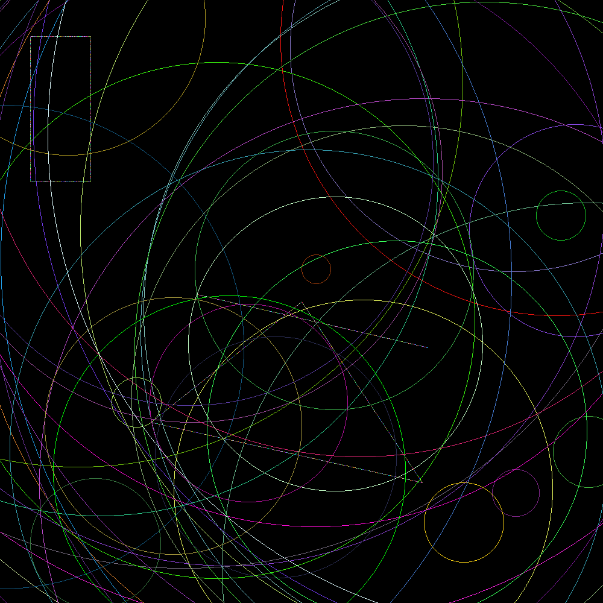

# Geometrical Shapes Drawer

This Rust project generates an image composed of various geometrical shapes — such as lines, circles, rectangles, triangles, and points — and saves the result as a PNG file using the [raster](https://crates.io/crates/raster) image processing library.

## 🖼️ Example Output

Here’s the generated image showing various shapes:




## 🧠 Project Concepts

This project teaches and reinforces the following key Rust programming concepts:

- **Modules and File Organization**
- **Traits and Trait Objects**
- **Structs with Associated Functions**
- **Randomized Geometry Generation**
- **Algorithm Implementation (DDA ,Midpoint Circle Algorithm)**

## 📁 Project Structure
```
├── src
│ ├── main.rs
│ └── geometrical_shapes.rs
├── Cargo.toml
└── image.png (generated)
```

## 🧩 Shapes Implemented

Each shape is defined as a struct with associated constructors:

- `Point` — created from `(x, y)`
- `Line` — from two `Point` references
- `Rectangle` — from two diagonal `Point` references
- `Triangle` — from three `Point` references
- `Circle` — from a `Point` and a radius

All shapes implement the `Drawable` trait, allowing them to be drawn onto a `raster::Image`.

## 🎯 Usage

- Clone the repository

- Add dependencies to `Cargo.toml`:
```toml
[dependencies]
raster = "0.2.0"
rand = "0.9.1"
```

- Run the program
```bash
cargo run
```
